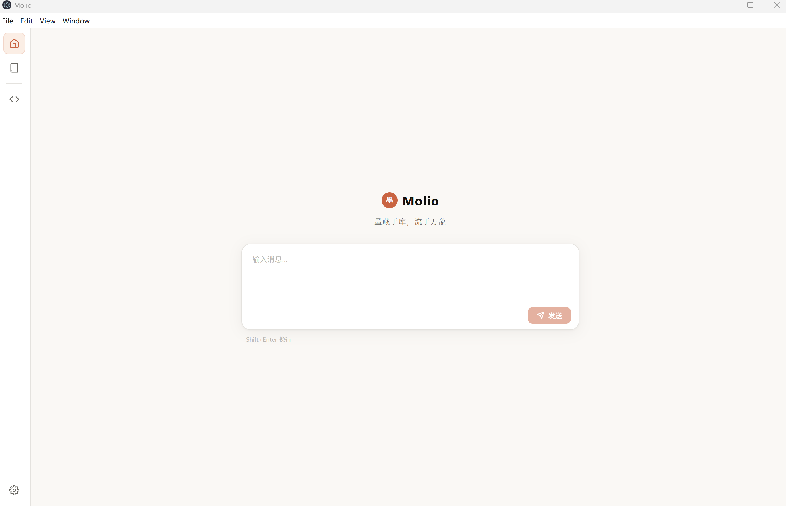
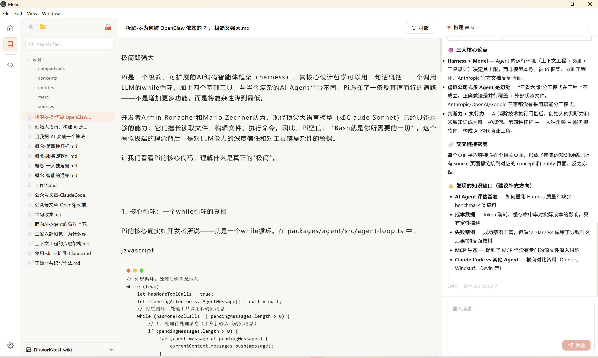
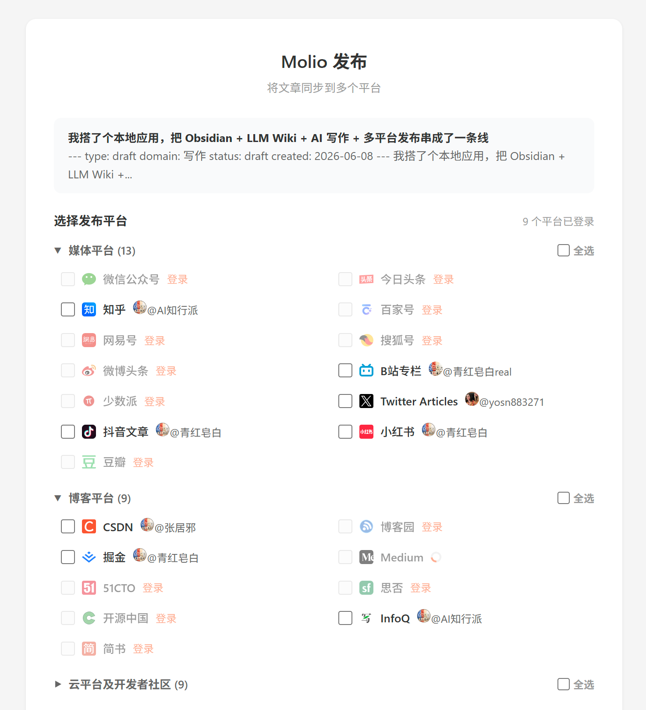

<div align="center">

# 📚 Molio

**Build your local second brain — AI-powered, your data stays yours.**

[English](README.md) · [中文](README_zh.md) · [🌐 Official Website](https://molio.cn/)

[](https://github.com/zhuzhaoyun/Molio/releases)
[](LICENSE)
[](https://github.com/zhuzhaoyun/Molio/stargazers)
[](https://github.com/zhuzhaoyun/Molio/commits)

</div>

---

Molio is a **local-first** desktop application that unifies knowledge management, AI writing, and content publishing. Open your existing Obsidian vault, write with Claude Code / Codex / Gemini in a beautiful graphical interface, and publish to 30+ platforms — all your data stays on your machine, never touching third-party servers.

### 🌟 Why Molio?

| Feature | Description |
|---------|-------------|
| 🗂️ **Obsidian-Compatible** | Point Molio at your existing Obsidian vault — zero migration, pure Markdown, no vendor lock-in |
| 🤖 **Multi-Agent + Local-First** | Use Claude Code, Codex, Gemini CLI, Qwen Code in a unified GUI with streaming output — all data stays on your machine, never touching third-party servers |
| ✂️ **[Web Clipper](https://chromewebstore.google.com/detail/pjdacbbkjpegfkogoieejajljplngbik)** | Chrome extension clips web pages to your vault with one click, auto-opens the desktop app. [Chrome Web Store](https://chromewebstore.google.com/detail/pjdacbbkjpegfkogoieejajljplngbik) \| [Other Browsers](https://molio.cn/download.html) |
| 📝 **Editor → Publish** | Split-pane Markdown editor with real-time preview, typesetting powered by [doocs/md](https://github.com/doocs/md), one-click publishing to 30+ platforms via [doocs/cose](https://github.com/doocs/cose) |
| 💬 **Messaging Integration** | Mobile chat with your knowledge base via WeChat (regional integration) |
| 📖 **Knowledge Graph** | Visual browsing of your knowledge connections and relationships |

### 📡 Channels

A single Molio instance can serve multiple channels in parallel. Most channels can be onboarded right from the Web console.

| Channel | Text | Image | File | Voice | Group |
|---------|:----:|:-----:|:----:|:-----:|:-----:|
| **Web Console** *(default)* | ✅ | ✅ | ✅ | ✅ | — |
| **WeChat** | ✅ | ✅ | ✅ | ⏳ | ⏳ |
| **Feishu** | ⏳ | ⏳ | ⏳ | ⏳ | ⏳ |
| Telegram | ⏳ | ⏳ | ⏳ | ⏳ | ⏳ |
| Slack | ⏳ | ⏳ | ⏳ | — | ⏳ |
| Discord | ⏳ | ⏳ | ⏳ | — | ⏳ |

✅ Supported · ⏳ Planned · — N/A

### 🖼️ Screenshots

<table>
  <tr>
    <td width="50%" align="center">
      
      <br/>
      <sub>AI Chat: Multi-agent support with streaming responses</sub>
    </td>
    <td width="50%" align="center">
      
      <br/>
      <sub>Knowledge Base: Vault file tree with Markdown rendering</sub>
    </td>
  </tr>
  <tr>
    <td width="50%" align="center">
      
      <br/>
      <sub>Editor: Split-pane with real-time preview</sub>
    </td>
    <td width="50%" align="center">
      
      <br/>
      <sub>Publishing: One-click sync to 30+ platforms</sub>
    </td>
  </tr>
</table>

## 🚀 Quick Start

### Installation

Download the latest release from [GitHub Releases](https://github.com/zhuzhaoyun/Molio/releases):

- **Windows**: `Molio-Setup-x.x.x.exe`
- **macOS**: `Molio-x.x.x.dmg`

Install and launch. On first run, you'll be guided to configure an AI runtime CLI (e.g., Claude Code, Codex, Gemini).

### Development (from source)

If you want to build from source or contribute to development:

**Prerequisites:**
- **Node.js** >= 22
- **pnpm** >= 9
- At least one AI runtime CLI:
  - [Claude Code](https://claude.ai/claude-code)
  - [OpenAI Codex CLI](https://github.com/openai/codex)
  - [Gemini CLI](https://github.com/google-gemini/gemini-cli)
  - [Qwen Code](https://github.com/QwenLM/qwen-code)

```bash
# Clone the repository
git clone https://github.com/zhuzhaoyun/Molio.git
cd Molio

# Install dependencies
pnpm install

# Start development environment (daemon + web)
pnpm dev

# Or start individually
pnpm dev:daemon   # Backend only (port 3100)
pnpm dev:web      # Frontend only (port 5173)
```

**Desktop Build:**

```bash
# One-click build + generate unpacked version
pnpm desktop:run

# Or full packaging as installer
pnpm package

# Generate unpacked directory only (no installer)
pnpm package:dir
```

**Testing:**

```bash
pnpm test         # Run all tests (node:test)
pnpm typecheck    # Type checking
pnpm build        # Build all packages
pnpm test:e2e     # E2E tests (requires pnpm dev running)
```

## 🏗️ Architecture

```
Molio/
├── packages/
│   └── contracts/       @molio/contracts — Shared type definitions
├── apps/
│   ├── daemon/          @molio/daemon   — Hono HTTP server (API + SSE)
│   ├── web/             @molio/web      — Vite + React frontend
│   └── desktop/         @molio/desktop  — Electron desktop shell
└── package.json         Monorepo root config
```

**Tech Stack:**
- **Frontend:** React 19 + Vite 6 + TypeScript
- **Backend:** Hono + Node.js + SQLite (better-sqlite3)
- **Desktop:** Electron 40 + electron-builder
- **Build:** pnpm workspace monorepo

## 🤝 Contributing

Contributions are welcome! Please see [CONTRIBUTING.md](CONTRIBUTING.md) for guidelines.

**Key principles:**
- All changes must go through Pull Request (no direct pushes to `main`)
- Follow [Conventional Commits](https://www.conventionalcommits.org/): `feat(scope): description`
- Add tests for bug fixes (unit tests for daemon/desktop, E2E for web)
- Run smoke tests before submitting PRs

## ❤️ Acknowledgments

Molio is inspired and supported by these excellent open-source projects:

- **[multica](https://github.com/multica-ai/multica)** — Open-source Agent management platform, inspiring Molio's multi-runtime orchestration
- **[doocs/md](https://github.com/doocs/md)** — WeChat Markdown editor, powering Molio's typesetting engine
- **[doocs/cose](https://github.com/doocs/cose)** — Multi-platform content distribution extension, powering Molio's publishing capabilities
- **[WeKnora](https://github.com/Tencent/WeKnora)** — Tencent's open-source knowledge management platform, providing design philosophy reference

Thanks to the authors and communities of these projects!

## 💬 Community & Support

File an issue on [GitHub](https://github.com/zhuzhaoyun/Molio/issues), or scan the QR code below to join our WeChat community:


## 📄 License

[Modified Apache 2.0](LICENSE) — Based on Apache License 2.0 with additional commercial use restrictions. Free for internal and non-commercial use; commercial hosting/embedding requires a commercial license.

---

<div align="center">

**If you find Molio useful, consider giving it a ⭐️ [star on GitHub](https://github.com/zhuzhaoyun/Molio)!**

[⭐ Star](https://github.com/zhuzhaoyun/Molio) · [🐛 Report Bug](https://github.com/zhuzhaoyun/Molio/issues) · [💡 Request Feature](https://github.com/zhuzhaoyun/Molio/issues)

</div>
