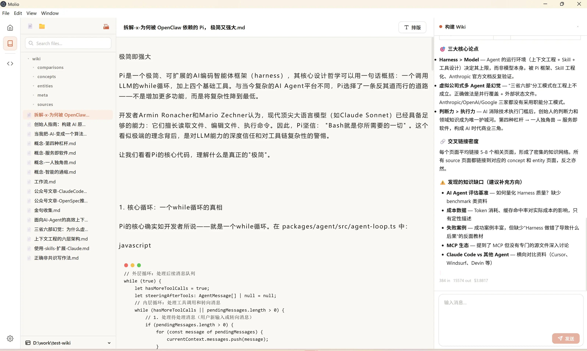
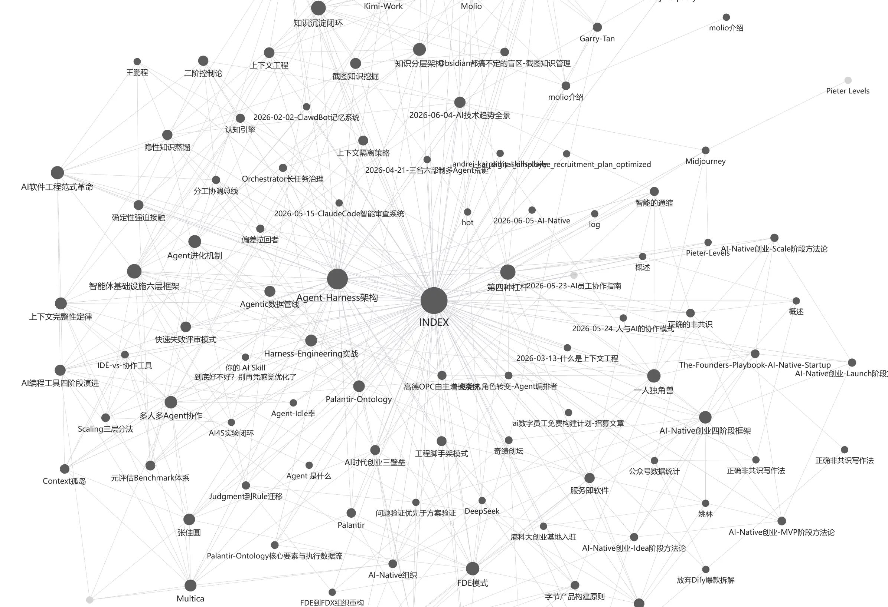

<div align="center">

# 📚 Molio

**Give AI your personal knowledge base. Local-first, and every byte stays yours.**

[English](README.md) · [中文](README_zh.md) · [🌐 Official Website](https://molio.cn/)

[](https://github.com/zhuzhaoyun/Molio/releases)
[](LICENSE)
[](https://github.com/zhuzhaoyun/Molio/stargazers)
[](https://github.com/zhuzhaoyun/Molio/commits)

</div>

---

Your experience, methods, and professional insights are scattered across notes, documents, and chat logs — invisible to AI, so every conversation starts from zero.

Molio turns that scattered material into a **personal knowledge base** that AI can read and use: Claude Code, Codex, and other agents enter your knowledge space, work on top of everything you've accumulated — researching, writing, answering, analyzing — and write their results back as Markdown, so the base grows thicker with every task. Everything runs on your machine, never through a third-party server.

Starting from zero? The [resource library](https://molio.cn/resources.html) ships ready-made knowledge bases that keep growing — import one and start asking.

<div align="center">

[](https://molio.cn/videos/zizhitongjian-overview.mp4)

**▶ Click to watch the demo** — one book, one knowledge universe: 1,362 years of history from the *Zizhi Tongjian*, processed by Molio into an AI-explorable knowledge base

</div>

### 🔁 How It Works

**01 · Collect & Process — from scattered fragments to a callable knowledge base**

Clip pages with one click via the [Web Clipper](https://chromewebstore.google.com/detail/pjdacbbkjpegfkogoieejajljplngbik), open your Obsidian vault directly, or batch-import local documents — pure Markdown, zero migration, no lock-in. The Wiki engine extracts entities and concepts, builds indexes and summaries, and the knowledge graph links everything together. Data becomes a foundation only after it's processed.

**02 · Work & Task — agents run on your data**

Claude Code, Codex, Gemini CLI, Qwen Code — agents work inside your knowledge space, researching, writing, answering, and analyzing. What they see is no blank slate, but everything you've accumulated. Pick an agent in a unified GUI with streaming output; scan a QR code to chat with your base from your phone via WeChat.

**03 · Reflow & Deposit — the base grows thicker with use**

Every task's output is written back as Markdown — a reusable, long-term asset. The knowledge graph keeps growing, so the next task starts from higher ground. Ready to publish? Typeset with doocs/md and distribute to 30+ platforms in one click.

### 📦 Ready-made Knowledge Bases

Beyond the tool itself, Molio offers **ready-made structured knowledge graphs** — entire books and professional domains pre-organized into AI-ready knowledge bases you can import in one click, no building from scratch.

Covering **literature, history, philosophy, traditional Chinese medicine, and medicine**, with **new resources added regularly**. Highlights include the ontology knowledge base, the *Zizhi Tongjian* knowledge system, and an obstetric-ultrasound knowledge base — free starter sets and premium deep-dive graphs alike. See the resource library for the full, always-current catalog.

> These are uniquely structured assets that AI cannot conjure on its own. Import one into Molio and instantly run AI Q&A, relationship lookup, and topical research.

**[Browse all resources →](https://molio.cn/resources.html)**

### 📡 Channels

A single Molio instance can serve multiple channels in parallel. Most channels can be onboarded right from the Web console.

| Channel | Text | Image | File | Voice | Group |
|---------|:----:|:-----:|:----:|:-----:|:-----:|
| **Web Console** *(default)* | ✅ | ✅ | ✅ | ✅ | — |
| **WeChat** | ✅ | ✅ | ✅ | ⏳ | ⏳ |
| **Feishu** | ✅ | ✅ | ✅ | ⏳ | ✅ |
| Telegram | ⏳ | ⏳ | ⏳ | ⏳ | ⏳ |
| Slack | ⏳ | ⏳ | ⏳ | — | ⏳ |
| Discord | ⏳ | ⏳ | ⏳ | — | ⏳ |

✅ Supported · ⏳ Planned · — N/A

### 🖼️ Screenshots

<table>
  <tr>
    <td width="50%" align="center">
      
      <br/>
      <sub>Agent Workbench: multi-agent support with streaming responses</sub>
    </td>
    <td width="50%" align="center">
      
      <br/>
      <sub>Knowledge Space: vault file tree with Markdown rendering</sub>
    </td>
  </tr>
  <tr>
    <td width="50%" align="center">
      
      <br/>
      <sub>Knowledge Graph: visual map of your knowledge connections</sub>
    </td>
    <td width="50%" align="center">
      
      <br/>
      <sub>Publishing: one-click sync to 30+ platforms</sub>
    </td>
  </tr>
</table>

## 🚀 Quick Start

### Installation

Download the latest release from [GitHub Releases](https://github.com/zhuzhaoyun/Molio/releases):

- **Windows**: `Molio-Setup-x.x.x.exe`
- **macOS**: `Molio-x.x.x.dmg`

Install and launch. On first run, you'll be guided to configure an AI runtime CLI (e.g., Claude Code, Codex, Gemini).

### 🐳 Docker / NAS Deployment (self-hosted)

Run Molio as a self-hosted web service on a NAS or server. A single container bundles the daemon, web UI, and Claude Code CLI, and works on both `linux/amd64` and `linux/arm64` — Synology, QNAP, TerraMaster, TrueNAS, Unraid, and most other NAS devices.

> **⚠️ How this differs from the desktop app (read before deploying)**
>
> - **Browser access only — there is no desktop client for this mode.** The Electron desktop app only ever talks to the daemon it launches locally (`localhost`); it **cannot** connect to a container running on a remote NAS/server.
> - **The daemon runs inside the container and can only read/write directories mounted into it.** The desktop workflow of "pick any local folder as a knowledge base via a folder picker" does not apply here — the browser has no folder picker, so when you add a knowledge base you **type a container-internal path** (e.g. `/vaults/your-folder`, not the NAS host path).
> - To expose folders as knowledge bases, mount them under `/vaults` in `docker-compose.yml` `volumes`. Your data still stays entirely yours (on your NAS) — only the access model changes, from "desktop app" to "browser + mounted volumes".

**One-click install** (requires Docker + Docker Compose v2):

```bash
# China (recommended)
curl -fsSL https://molio-releases.oss-cn-guangzhou.aliyuncs.com/script/install.sh | bash
# Overseas
curl -fsSL https://raw.githubusercontent.com/zhuzhaoyun/Molio/main/install.sh | bash
# Offline (clone the repo first, then run the bundled script)
bash install.sh
```

The script asks for your knowledge-base directory and port, then pulls the image and starts the service. When it finishes, open `http://<your-server-ip>:3100`, then go to **Settings → Runtimes** to configure your AI model and API key. On first boot Molio **auto-creates a default knowledge base** on the mounted directory, so you land straight inside — no manual setup.

**Manual install** (if you prefer plain `docker compose`):

```bash
git clone https://github.com/zhuzhaoyun/Molio.git && cd Molio
cp .env.example .env      # AI model is configured later in the web UI
docker compose up -d      # then open http://<your-server-ip>:3100
```

**Everyday commands** (run inside the install directory, default `~/molio`):

```bash
docker compose logs -f                          # follow logs
docker compose restart                          # restart
docker compose pull && docker compose up -d     # update to the latest image
docker compose down                             # stop
```

> Set `MOLIO_VAULT_PATH` in `.env` to mount your existing documents folder into the container (at `/vaults`). See [`install.sh`](install.sh) and [`.env.example`](.env.example) for every option.

### Development (from source)

If you want to build from source or contribute to development:

**Prerequisites:**
- **Node.js** >= 22
- **pnpm** >= 9
- At least one AI runtime CLI:
  - [Claude Code](https://claude.ai/claude-code)
  - [OpenAI Codex CLI](https://github.com/openai/codex)
  - [Gemini CLI](https://github.com/google-gemini/gemini-cli)
  - [Qwen Code](https://github.com/QwenLM/qwen-code)

```bash
# Clone the repository
git clone https://github.com/zhuzhaoyun/Molio.git
cd Molio

# Install dependencies
pnpm install

# Start development environment (daemon + web)
pnpm dev

# Or start individually
pnpm dev:daemon   # Backend only (port 3100)
pnpm dev:web      # Frontend only (port 5173)
```

**Desktop Build:**

```bash
# One-click build + generate unpacked version
pnpm desktop:run

# Or full packaging as installer
pnpm package

# Generate unpacked directory only (no installer)
pnpm package:dir
```

**Testing:**

```bash
pnpm test         # Run all tests (node:test)
pnpm typecheck    # Type checking
pnpm build        # Build all packages
pnpm test:e2e     # E2E tests (requires pnpm dev running)
```

## 🏗️ Architecture

```
Molio/
├── packages/
│   └── contracts/       @molio/contracts — Shared type definitions
├── apps/
│   ├── daemon/          @molio/daemon   — Hono HTTP server (API + SSE)
│   ├── web/             @molio/web      — Vite + React frontend
│   └── desktop/         @molio/desktop  — Electron desktop shell
└── package.json         Monorepo root config
```

**Tech Stack:**
- **Frontend:** React 19 + Vite 6 + TypeScript
- **Backend:** Hono + Node.js + SQLite (better-sqlite3)
- **Desktop:** Electron 40 + electron-builder
- **Build:** pnpm workspace monorepo

## ❓ FAQ

### macOS says the app is "damaged and can't be opened"

This is macOS Gatekeeper's security warning, because Molio is currently **not notarized with Apple** (requires an Apple Developer Program subscription at $99/year). It's not a problem with the app itself. Either:

**Option 1 (recommended)**: Right-click the app → "Open" → click "Open" in the dialog (first launch only).

**Option 2**: Run in Terminal:
```bash
sudo xattr -d com.apple.quarantine /Applications/Molio.app
```

After that, it opens normally with a double-click.

## 🏢 Custom Services

Keep your core knowledge in your own yard — data processing, consulting, and private deployment on demand. One demo says it all.

**[Learn more →](https://molio.cn/enterprise.html)**

## 🤝 Contributing

Contributions are welcome! Please see [CONTRIBUTING.md](CONTRIBUTING.md) for guidelines.

**Key principles:**
- All changes must go through Pull Request (no direct pushes to `main`)
- Follow [Conventional Commits](https://www.conventionalcommits.org/): `feat(scope): description`
- Add tests for bug fixes (unit tests for daemon/desktop, E2E for web)
- Run smoke tests before submitting PRs

## 💬 Community & Support

File an issue on [GitHub](https://github.com/zhuzhaoyun/Molio/issues), or scan the QR code below to join our WeChat community:


## ❤️ Acknowledgments

Molio is inspired and supported by these excellent open-source projects:

- **[multica](https://github.com/multica-ai/multica)** — Open-source Agent management platform, inspiring Molio's multi-runtime orchestration
- **[doocs/md](https://github.com/doocs/md)** — WeChat Markdown editor, powering Molio's typesetting engine
- **[doocs/cose](https://github.com/doocs/cose)** — Multi-platform content distribution extension, powering Molio's publishing capabilities
- **[WeKnora](https://github.com/Tencent/WeKnora)** — Tencent's open-source knowledge management platform, providing design philosophy reference

Thanks to the authors and communities of these projects!

## 📄 License

[Modified Apache 2.0](LICENSE) — Based on Apache License 2.0 with additional commercial use restrictions. Free for internal and non-commercial use; commercial hosting/embedding requires a commercial license.

---

<div align="center">

**If you find Molio useful, consider giving it a ⭐️ [star on GitHub](https://github.com/zhuzhaoyun/Molio)!**

[⭐ Star](https://github.com/zhuzhaoyun/Molio) · [🐛 Report Bug](https://github.com/zhuzhaoyun/Molio/issues) · [💡 Request Feature](https://github.com/zhuzhaoyun/Molio/issues)

</div>
